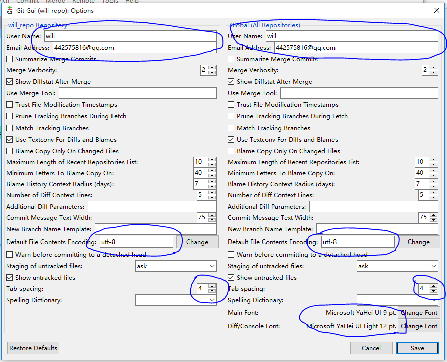

Git使用手册
===========

### 下载Git Windows
[Git Windows](https://git-scm.com/download/)

### Git设置

- 在本地新建Git Workspace
- 进入该目录，右键`Git Bash Here`
- 输入命令

```Bash
# 初始化git
git init

# 存储git用户名和密码
git config --global credential.helper store
```
- 修改Git配置



### Git使用简介
- [git简易指南](http://www.bootcss.com/p/git-guide/)
- [git基本操作](http://www.runoob.com/git/git-basic-operations.html)
- [git教程](http://www.liaoxuefeng.com/wiki/0013739516305929606dd18361248578c67b8067c8c017b000)

