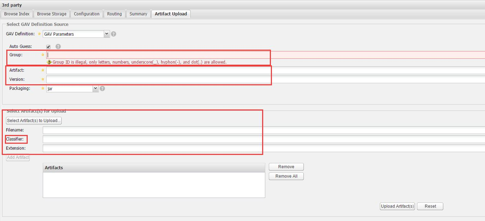

Gradle使用手册
==============

### 下载Gradle
- [Gradle下载](http://gradle.org/gradle-download/)

### 安装Gradle
- 解压下载的安装包到你想安装的位置，例如：`C:\D\gradle`
- 设置环境变量

```Bash
GRADLE_HOME = C:\D\gradle

# PATH最后添加
;%GRADLE_HOME%\bin

# cmd中输入
gradle -v

# 出现下面结果表示正常安装好了
------------------------------------------------------------
Gradle 2.13
------------------------------------------------------------

Build time:   2016-04-25 04:10:10 UTC
Build number: none
Revision:     3b427b1481e46232107303c90be7b05079b05b1c

Groovy:       2.4.4
Ant:          Apache Ant(TM) version 1.9.6 compiled on June 29 2015
JVM:          1.7.0_60 (Oracle Corporation 24.60-b09)
OS:           Windows 8.1 6.3 x86
```

### Gradle日常使用
- 添加依赖, **Tips:**添加依赖之前可以去[Maven仓库](http://search.maven.org/)搜索一下

```Gradle
apply plugin: 'java'

repositories {
    mavenCentral()
}

dependencies {
    compile(
            'org.apache.commons:commons-lang3:3.2.1',
            'org.apache.commons:commons-io:1.3.2',
            'com.google.guava:guava:16.0'
    )
    testCompile(
        'junit:junit:4.11'
    )
}
```

- 生成idea或eclipse项目文件
 - 添加插件：`apply plugin: 'idea'`、`apply plugin: 'eclipse'`
 - 到根目录输入：`gradle idea`、`gradle eclipse`
- [Gradle学习系列](http://www.cnblogs.com/CloudTeng/p/3417762.html)
- 解决Gradle build报编码错误：`[compileJava, compileTestJava]*.options*.encoding = 'UTF-8'`

### 自建Maven仓库
- 下载Nexus
 
 [Nexus Repository OSS](http://www.sonatype.com/download-oss-sonatype)

- 安装Nexus，Windows安装过程如下：

```Bash
# 已管理员身份运行cmd
#1. cd到解压目录
cd C:\D\nexus\bin\jsw\windows-x86-64

#2. 安装nexus
install-nexus.bat

#3. 运行nexus
start-nexus.bat
```

- 打开浏览器访问`http://127.0.0.1:8081/nexus/`，默认管理员用户名和密码是: `admin/admin123`
- 开始自建第三方仓库


- 自己上传jar包



 **注意：**
 - 1) GroupId可以在[Maven仓库](http://search.maven.org/)搜索到
 - 2) Artifact一般选择好上传的jar会自动分析出来
 - 3) 如果选择的jar命名结果为`1.0.0-GA.jar`，version部分需要填写：`1.0.0-GA`
 - 4) Classifier保持为空，`1.0.0-GA.jar`这样的jar包会自动帮你填上GA，需要手动去除掉


- 如果安装了Maven，Maven中向本地仓库手动添加jar

 `mvn install:install-file -Dfile=C:\D\sonatype-work\nexus\storage\central\org\springframework\spring-aop\4.1.1.RELEASE\spring-aop-4.1.1.RELEASE.jar -DgroupId=org.springframework -DartifactId=spring-aop -Dversion=4.1.1.RELEASE -Dpackaging=jar`